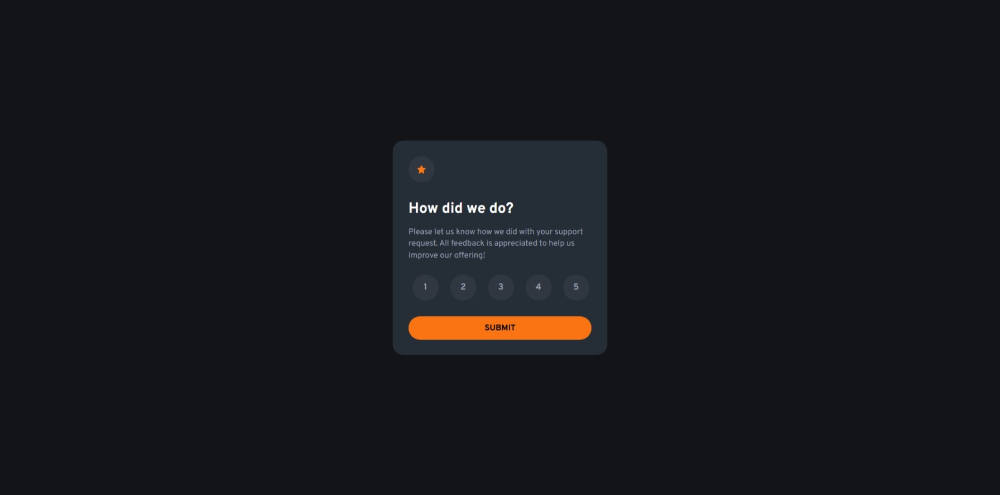

# Frontend Mentor - Interactive rating component solution

This is a solution to the [Interactive rating component challenge on Frontend Mentor](https://www.frontendmentor.io/challenges/interactive-rating-component-koxpeBUmI). Frontend Mentor challenges help you improve your coding skills by building realistic projects. 

## Table of contents

- [Overview](#overview)
  - [The challenge](#the-challenge)
  - [Screenshot](#screenshot)
  - [Links](#links)
- [My process](#my-process)
  - [Built with](#built-with)
  - [What I learned](#what-i-learned)
  - [Continued development](#continued-development)
  - [AI Collaboration](#ai-collaboration)
- [Author](#author)


## Overview

### The challenge

Users should be able to:

- View the optimal layout for the app depending on their device's screen size
- See hover states for all interactive elements on the page
- Select and submit a number rating
- See the "Thank you" card state after submitting a rating

### Screenshot



### Links

- Solution URL: [Frontend Mentor Solution](https://www.frontendmentor.io/solutions/interactive-rating-component-DmYZO4H-Li)
- Live Site URL: [Interactive Rating Component Site](https://osmond20.github.io/Interactive-Rating-Component/)

## My process

### Built with

- Semantic HTML5 markup
- CSS custom properties
- Flexbox
- CSS Grid
- Mobile-first workflow
- SCSS for CSS preprocessing

### What I learned

I learned to apply a simple animation, as I was pracitising implementing one. I discovered in my learning process that animation are not as complex as I though they were.

To see how you can add code snippets, see below:

```css
.thank-you-state-component.show{
   animation: fadeIn 0.9s ease-in 1;
   opacity: 1;
}

@keyframes fadeIn {
  0%{
    scale:0.45;
    opacity: 0.25;
  }
  
  50%{
    scale:0.5;
    opacity:0.50;
  }
}
```

### Continued development

I will be prioritizing getting better with my JS, while maintaing responsive design knowledge that I have built up thus far.

### AI Collaboration

- What tools did you use (e.g., ChatGPT, Claude, GitHub Copilot)? Github Copilot
- How did you use them (e.g., debugging, generating boilerplate, brainstorming solutions)? I used for assesing any issues I encountered when I was trying to apply the clamp function.

## Author

- Website - [Github](https://www.github.com/osmond20)
- Frontend Mentor - [@osmond20](https://www.frontendmentor.io/profile/osmond20)

